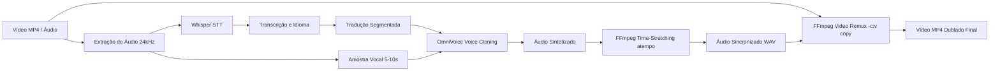

# 🎙️ Matraca — Dublador & Clonador de Voz com IA

[](https://colab.research.google.com/github/danieldemoraisgurgel/matracastudio/blob/main/OmniVoice_Dubbing.ipynb)


> **Duble qualquer vídeo MP4 ou áudio clonando a sua própria voz e mantendo exatamente o mesmo tempo de duração do conteúdo original!**

O **Matraca Studio** é uma suíte completa de localização e dublagem de vídeo e áudio potencializada por Inteligência Artificial. Com ele, você envia uma gravação, o sistema transcreve o conteúdo, traduz para o idioma desejado, clona a sua voz e sincroniza milimetricamente o áudio traduzido com a duração do vídeo original, exportando o novo vídeo pronto e em alta definição.

---

## ✨ Principais Funcionalidades

- 🎥 **Entrada Universal de Mídia**: Suporte para vídeos (`.mp4`, `.mov`, `.mkv`, `.avi`), faixas de áudio (`.wav`, `.mp3`, `.m4a`) ou gravação direta pelo microfone.
- 🗣️ **Reconhecimento Preciso (Whisper)**: Transcrição automática com alta fidelidade e detecção do idioma de origem.
- 🌍 **Tradução em Chunks Inteligentes**: Sistema sem limite de caracteres (supera a barreira de 5.000 caracteres de APIs padrão com chunking por final de frase).
- 🧬 **Clonagem de Voz Zero-Shot (OmniVoice)**: Preserva o timbre, entonação e características vocais únicas de quem falou.
- ⏱️ **Sincronização Temporal Milimétrica**: Algoritmo inteligente com filtro `atempo` via FFmpeg que acelera ou desacelera a fala sem distorcer o tom (*pitch-preserved time stretch*), casando a dublagem perfeitamente com o tempo do vídeo.
- 🎬 **Remuxing Instantâneo de Vídeo**: Substituição direta da trilha de áudio no vídeo original usando cópia de stream (`-c:v copy`), sem perda de qualidade visual e renderização em segundos.
- 💻 **Interface Web Moderna (Gradio)**: Player de vídeo e áudio lado a lado, download imediato dos arquivos gerados e visualização das métricas de sincronização.
- ✍️ **Aba de Clonagem Livre (TTS)**: Permite sintetizar qualquer texto digitado com a sua voz clonada.

---

## 🌐 Idiomas em Destaque

| Idioma | Código | Suporte |
| :--- | :---: | :---: |
| 🇧🇷 **Português do Brasil (pt-BR)** | `pt-BR` | Transcrição, Tradução e Clonagem |
| 🇺🇸 **Inglês (English)** | `en` | Transcrição, Tradução e Clonagem |
| 🇪🇸 **Espanhol (Español)** | `es` | Transcrição, Tradução e Clonagem |
| 🇫🇷 **Francês (Français)** | `fr` | Transcrição, Tradução e Clonagem |
| 🇩🇪 **Alemão (Deutsch)** | `de` | Transcrição, Tradução e Clonagem |
| 🇨🇳 **Chinês Simplificado (中文)** | `zh-CN` | Transcrição, Tradução e Clonagem |
| 🇸🇦 **Árabe (العربية)** | `ar` | Transcrição, Tradução e Clonagem |
| 🇮🇹 **Italiano (Italiano)** | `it` | Transcrição, Tradução e Clonagem |
| 🇯🇵 **Japonês (日本語)** | `ja` | Transcrição, Tradução e Clonagem |
| 🇷🇺 **Russo (Русский)** | `ru` | Transcrição, Tradução e Clonagem |

---

## 🔄 Fluxo de Processamento (Pipeline)



---

## 🚀 Como Executar no Google Colab

1. Abra o notebook diretamente no Google Colab clicando no badge abaixo:  
   [](https://colab.research.google.com/github/danieldemoraisgurgel/matracastudio/blob/main/OmniVoice_Dubbing.ipynb)
2. Ative a aceleração por GPU:
   - No menu superior, acerte em **Ambiente de Execução** (*Runtime*) ➔ **Alterar tipo de ambiente de execução** (*Change runtime type*).
   - Selecione **T4 GPU** e salve.
3. Execute as células sequencialmente:
   - **Passo 1:** Instala as dependências e o FFmpeg.
   - **Passo 2:** Carrega o Whisper e o OmniVoice na VRAM da GPU.
   - **Passo 3:** Compila o motor de sincronização temporal e tradução robusta.
   - **Passo 4:** Inicia a aplicação Gradio e gera o link público compartilhavel (`https://...gradio.live`).
4. Abra o link da interface, suba o seu vídeo ou áudio, escolha o idioma de destino e clique em **✨ Dublar e Sincronizar Vídeo/Áudio**.

---

## 📁 Estrutura do Projeto

```text
matracastudio/
├── OmniVoice_Dubbing.ipynb   # Notebook completo com backend e interface Gradio
├── README.md                 # Documentação oficial do projeto
├── LICENSE                   # Licença MIT
└── .gitignore                # Arquivos e extensões ignoradas no versionamento
```

---

## 📄 Licença

Este projeto é distribuído sob a licença **MIT**. Consulte o arquivo [LICENSE](LICENSE) para obter mais informações.
